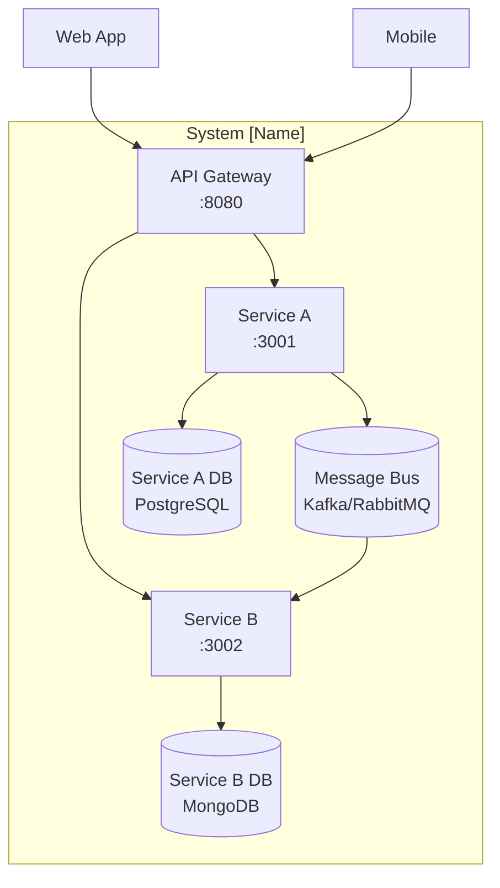

# System Architecture Overview

> **What to fill in here:** The architectural view is the technical snapshot of the system.
> It includes the C4 system and container diagram, service list, and architectural principles.
> This document is created after the main ADRs and guides the implementation.

---

## 1. Adopted architectural style

**Style:** Microservices, communicating over REST + FCM push notifications (no event bus)

**Justification:** ixGo's three bounded contexts (`02-domain/domain-map.md`) map cleanly
to three independently deployable services, each with different operational needs —
`service-request` is the only one bound by the 3-second matching SLA (NFR-01) and needs
a real-time data layer, while `auth-service` and `service-execution` are ordinary CRUD
workloads. Separating them lets the latency-critical service scale independently.

**Reference ADR:** [`ADR-002-architectural-style.md`](decisions/records/ADR-002-architectural-style.md)

---

## 2. C4 Diagram — System Level (Context)

> Shows how the system fits in the world. External actors and external systems.

```
┌─────────────────────────────────────────────────────────────────────┐
│                        System FixGo                                 │
│                                                                     │
│  ┌─────────────┐    ┌─────────────────┐    ┌────────────────────┐  │
│  │auth-service │    │ service-request │    │ service-execution  │  │
│  │             │    │                 │    │                    │  │
│  │ Port: 3001  │    │ Port: 3002      │    │ Port: 3003         │  │
│  └──────┬──────┘    └──────┬──────────┘    └──────────┬─────────┘  │
│         │                  │                           │            │
│         └──────────────────┴───────────────────────────┘            │
│                            │ FCM (push notifications only)          │
└────────────────────────────│────────────────────────────────────────┘
                             │
                  ┌──────────┴──────────┐
                  │                     │
         ┌────────▼──────┐    ┌─────────▼──────┐
         │ API Gateway   │    │ Admin Dashboard │
         │               │    │  (Administrator)│
         └────────┬──────┘    └─────────────────┘
                  │
         ┌────────▼──────────────┐
         │    External clients   │
         │ (Android app: Driver, │
         │   Mechanic)            │
         └───────────────────────┘
```

---

## 3. C4 Diagram — Container Level

> Shows the processes, databases, and main communication channels.

```
Replace this block with the project-specific diagram.

Recommended tools:
- PlantUML (see 08-uml/diagrams/source/)
- Mermaid (natively supported on GitHub)
- draw.io / Lucidchart
```

**Mermaid example:**



---

## 4. Service catalog

| # | Service | Responsibility | Port | DB | Communication type |
|---|---------|---------------|------|-----|-------------------|
| 1 | api-gateway | Routing, auth validation, rate limiting | 8080 | None | HTTP Proxy |
| 2 | auth-service | Registration, login, JWT tokens, RBAC, Driver/Mechanic/Vehicle records | 3001 | MySQL | REST |
| 3 | service-request | Service request lifecycle, mechanic matching, live GPS tracking | 3002 | MySQL + Firebase Realtime Database | REST + FCM push |
| 4 | service-execution | Diagnostic registration, request closure | 3003 | MySQL | REST |
> Full detail per service in `09-microservices/service-catalog.md`

---

## 5. Architectural principles

These principles guide the project's technical decisions. Before making an important decision,
verify it is consistent with these principles.

### P1: API-First
Design the API contract (OpenAPI) before implementing the service.
Contracts are the source of truth for consumers.

### P2: Database per Service
Each service has its own database. No service directly accesses another service's database.
Communication is always through API or events.

### P3: Fail Fast, Recover Gracefully
Detect errors early (validation at the edge). When an external service fails,
use Circuit Breaker to prevent cascades. Always define a fallback.

### P4: Observability by Design
From day 1: structured JSON logs, metrics with Prometheus,
distributed traces with Jaeger/Zipkin. It is not optional or a story for "later".

### P5: [Additional principle name]
[Description]

---

## 6. Adopted architectural patterns

| Pattern | Adopted | Reference |
|---------|---------|-----------|
| API Gateway | Yes | `05-architecture/pattern-guide.md` |
| Database per Service | Yes | ADR-00X |
| CQRS | No (review in Q3) | |
| Event Sourcing | No | |
| Circuit Breaker | Yes | ADR-00X |
| Saga (choreographed) | Yes | ADR-00X |
| Outbox Pattern | Yes | ADR-00X |

---

## 7. Cross-cutting concerns

Transversal concerns that apply to ALL services:

| Concern | Adopted solution | Where it is configured |
|---------|----------------|------------------------|
| Authentication / Authorization | JWT + validation in API Gateway | `00-governance/security-policy.md` |
| Logging | Structured JSON + Correlation ID | Shared logger in internal lib |
| Tracing | OpenTelemetry → Jaeger | Middleware in each service |
| Health Checks | GET /health (liveness) + GET /health/ready (readiness) | Service template |
| Error format | Standard ErrorResponse | `07-api/contracts/openapi/_shared.yaml` |
| Rate Limiting | At the API Gateway | Kong/NGINX configuration |
| CORS | Configured in API Gateway | |
| Circuit Breaker | Resiliency4j / opossum per service | Pattern in `pattern-guide.md` |

---

## 8. Registered architectural technical debt

| ID | Description | Impact | Priority | Target sprint |
|----|-------------|--------|---------|--------------|
| AT-001 | No automated tests exist yet for any of the 13 user stories (see `04-requirements/traceability-matrix.md`) | High | P1 | Once code repos exist, before Entrega 3 |
| AT-002 | `service-request`'s dependency on Firebase Realtime Database for GPS is not yet validated against the 15-meter accuracy NFR under real network conditions | Medium | P2 | Post-remediation |

> See also: `15-project-control/technical-backlog.md`

---

## 9. Planned evolution

| Version | Architectural change | Motivation | Estimated date |
|---------|---------------------|------------|----------------|
| v1.1 | Add an in-app payment service (out of scope for v1.0, see `01-context/scope.md`) | Direct settlement between driver and mechanic has no dispute record today | Post-course, not scheduled |

---

## Key correlations

- Domain bounded contexts → `02-domain/domain-map.md`
- Specific decision ADRs → `05-architecture/decisions/`
- Hexagonal architecture per service → `05-architecture/hexagonal-architecture.md`
- Applied patterns → `05-architecture/pattern-guide.md`
- Per-service detail → `09-microservices/service-catalog.md`
- UML diagrams → `08-uml/`
