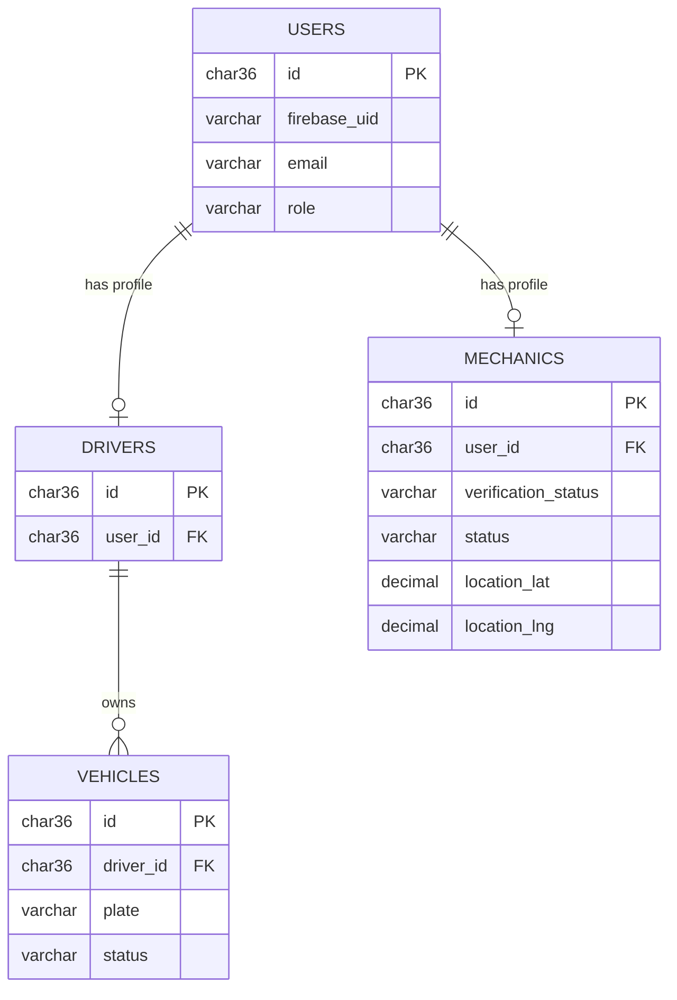
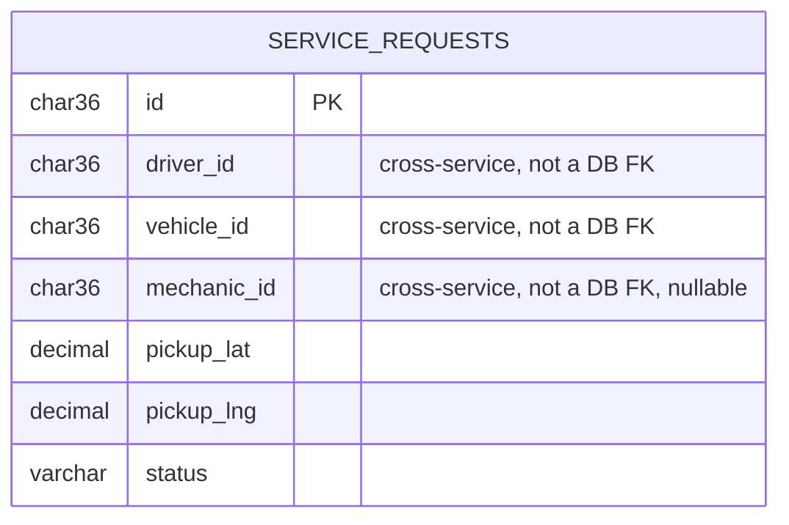
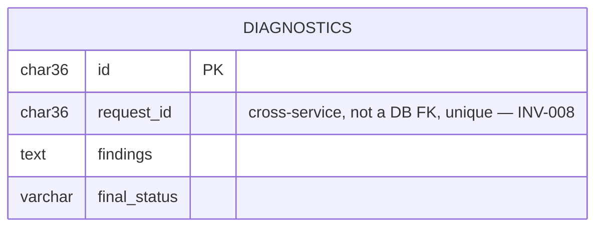

# Data Models per Service

> **What to fill in here:** The data schema for each microservice.
> Each service has its own section. Remember: **each service has its own database**.
> Schema changes are always done with versioned migrations, never by modifying tables in place.

> **DB engine note:** This document is technology-agnostic. The examples show standard SQL
> compatible with most relational engines. For document databases
> (MongoDB) or key-value stores (Redis), adapt the diagrams and schemas to the corresponding format.
> The engine choice is documented in each service section — the scaffold does not assume which one to use.

---

## Data modeling principles

### 1. Database per Service (mandatory)
No service directly accesses another service's database.
Communication between services is always via API or events.

```
✓ Service A → DB A (PostgreSQL)
✓ Service B → DB B (MongoDB)
✗ Service A → JOIN with Service B's tables
```

### 2. Standard audit fields
All tables include:

```sql
id          UUID        PRIMARY KEY  DEFAULT gen_random_uuid(),
created_at  TIMESTAMPTZ NOT NULL     DEFAULT NOW(),
updated_at  TIMESTAMPTZ NOT NULL     DEFAULT NOW(),
deleted_at  TIMESTAMPTZ              -- NULL = active (soft delete)
```

### 3. Soft delete by default
Do not delete records with a physical DELETE. Use `deleted_at IS NOT NULL` to mark as deleted.
This facilitates auditing and recovery.

### 4. Naming conventions

```sql
-- Tables:      snake_case, plural              → orders, order_items, users
-- Columns:     snake_case, descriptive         → unit_price, delivery_date
-- FKs:         [referenced_table]_id           → customer_id, product_id
-- Indexes:     idx_[table]_[column(s)]         → idx_orders_customer_id
-- Timestamps:  always with timezone (TIMESTAMPTZ, not TIMESTAMP)
```

---

## Service: auth-service
 
**DB Engine:** MySQL 8 — decided in [`ADR-003-data-strategy.md`](../05-architecture/decisions/records/ADR-003-data-strategy.md)
 
**Engine justification:**
- MySQL's foreign keys and transactions enforce this service's hard invariants at the
  database level — INV-005 (a Driver needs an active Vehicle), INV-006 (unique plate),
  INV-001/INV-002 (a Mechanic must be verified and have a fresh location to be matched).
- No document or geo features are needed here — every field is a plain relational column.
- `[table]_id UUID CHAR(36)` is used instead of PostgreSQL's native `UUID` type, since
  MySQL has no built-in UUID type; `TIMESTAMP` is used instead of `TIMESTAMPTZ` (MySQL
  stores `TIMESTAMP` internally as UTC).

### Table: users
 
**Purpose:** The base authenticated account. Firebase Authentication owns the password —
this table only stores the resulting identity and role (see `00-governance/security-policy.md`).
 
```sql
CREATE TABLE users (
  id              CHAR(36)     PRIMARY KEY DEFAULT (UUID()),
 
  -- Business fields
  firebase_uid    VARCHAR(128) NOT NULL,
  email           VARCHAR(255) NOT NULL,
  role            VARCHAR(20)  NOT NULL
                  CHECK (role IN ('DRIVER', 'MECHANIC', 'ADMIN')),
 
  -- Status fields
  status          VARCHAR(50)  NOT NULL DEFAULT 'ACTIVE'
                  CHECK (status IN ('ACTIVE', 'SUSPENDED')),
 
  -- Audit (in all tables)
  created_at      TIMESTAMP    NOT NULL DEFAULT CURRENT_TIMESTAMP,
  updated_at      TIMESTAMP    NOT NULL DEFAULT CURRENT_TIMESTAMP ON UPDATE CURRENT_TIMESTAMP,
  deleted_at      TIMESTAMP    NULL
);
 
-- Indexes
CREATE UNIQUE INDEX idx_users_firebase_uid ON users (firebase_uid);
CREATE UNIQUE INDEX idx_users_email ON users (email);
CREATE INDEX idx_users_deleted ON users (deleted_at);
```

```

**Data dictionary:**

| Column | Type | Description | Example |
|--------|------|-------------|---------|
| id | CHAR(36) | Auto-generated unique identifier | `550e8400-...` |
| firebase_uid | VARCHAR(128) | Firebase Authentication's own user ID | `a1B2c3D4...` |
| email | VARCHAR(255) | Account email | `driver@example.com` |
| role | VARCHAR(20) | DRIVER, MECHANIC, or ADMIN — decides which of the tables below applies | `DRIVER` |
| status | VARCHAR(50) | ACTIVE unless an admin suspends the account | `ACTIVE` |
| created_at | TIMESTAMP | When the record was created | `2026-09-15 10:30:00` |
| deleted_at | TIMESTAMP | NULL = active; with value = deleted | `NULL` |

---

### Table: [related_table]

```sql
CREATE TABLE [related_table] (
  id              UUID        PRIMARY KEY DEFAULT gen_random_uuid(),
  [principal]_id  UUID        NOT NULL REFERENCES [principal_table](id) ON DELETE CASCADE,
  
  -- Fields
  [field]         [TYPE]      NOT NULL,
  
  -- Audit
  created_at      TIMESTAMPTZ NOT NULL DEFAULT NOW(),
  updated_at      TIMESTAMPTZ NOT NULL DEFAULT NOW(),
  deleted_at      TIMESTAMPTZ
);

**Modeling decisions:**
1. `firebase_uid` is NOT NULL because Firebase Auth is the only registration path — there
   is no local password field, by design (`00-governance/security-policy.md`).
2. Soft delete is used so an audit trail (SRS Module 7) survives account deletion.
3. `role` decides which child table (`drivers` or `mechanics`) has a matching row — a
   user with role `DRIVER` always has exactly one row in `drivers`.

```
### Table: drivers
 
```sql
CREATE TABLE drivers (
  id              CHAR(36)     PRIMARY KEY DEFAULT (UUID()),
  user_id         CHAR(36)     NOT NULL REFERENCES users(id) ON DELETE RESTRICT,
 
  -- Audit
  created_at      TIMESTAMP    NOT NULL DEFAULT CURRENT_TIMESTAMP,
  updated_at      TIMESTAMP    NOT NULL DEFAULT CURRENT_TIMESTAMP ON UPDATE CURRENT_TIMESTAMP,
  deleted_at      TIMESTAMP    NULL
);
 
CREATE UNIQUE INDEX idx_drivers_user_id ON drivers (user_id);
```
 
---
 
### Table: vehicles
 
```sql
CREATE TABLE vehicles (
  id              CHAR(36)     PRIMARY KEY DEFAULT (UUID()),
  driver_id       CHAR(36)     NOT NULL REFERENCES drivers(id) ON DELETE RESTRICT,
 
  -- Business fields (SRS RF2.1)
  plate           VARCHAR(10)  NOT NULL,
  brand           VARCHAR(50)  NOT NULL,
  model           VARCHAR(50)  NOT NULL,
  type            VARCHAR(20)  NOT NULL
                  CHECK (type IN ('CAR', 'MOTORCYCLE')),
 
  -- Status fields
  status          VARCHAR(50)  NOT NULL DEFAULT 'ACTIVE'
                  CHECK (status IN ('ACTIVE', 'INACTIVE')),
 
  -- Audit
  created_at      TIMESTAMP    NOT NULL DEFAULT CURRENT_TIMESTAMP,
  updated_at      TIMESTAMP    NOT NULL DEFAULT CURRENT_TIMESTAMP ON UPDATE CURRENT_TIMESTAMP,
  deleted_at      TIMESTAMP    NULL
);
 
-- Indexes
CREATE UNIQUE INDEX idx_vehicles_plate ON vehicles (plate);
CREATE INDEX idx_vehicles_driver_id ON vehicles (driver_id);
CREATE INDEX idx_vehicles_deleted ON vehicles (deleted_at);
```
 
**Data dictionary:**
 
| Column | Type | Description | Example |
|--------|------|-------------|---------|
| plate | VARCHAR(10) | License plate, unique across the system (INV-006) | `ABC123` |
| type | VARCHAR(20) | CAR or MOTORCYCLE | `CAR` |
| status | VARCHAR(50) | ACTIVE (usable in a request) or INACTIVE (kept for history) | `ACTIVE` |
 
**Modeling decisions:**
1. `plate` has a UNIQUE index because INV-006 requires it — enforced at the database, not
   only in application code.
2. `status` uses INACTIVE instead of a hard delete, per INV-007 (deactivation preserves history).
---
 
### Table: mechanics
 
```sql
CREATE TABLE mechanics (
  id                   CHAR(36)     PRIMARY KEY DEFAULT (UUID()),
  user_id              CHAR(36)     NOT NULL REFERENCES users(id) ON DELETE RESTRICT,
 
  -- Business fields
  workshop_name        VARCHAR(150) NOT NULL,
  verification_status  VARCHAR(30)  NOT NULL DEFAULT 'PENDING_VERIFICATION'
                       CHECK (verification_status IN ('PENDING_VERIFICATION', 'VERIFIED', 'REJECTED')),
  status               VARCHAR(20)  NOT NULL DEFAULT 'OFFLINE'
                       CHECK (status IN ('AVAILABLE', 'BUSY', 'OFFLINE')),
  location_lat         DECIMAL(9,6),
  location_lng         DECIMAL(9,6),
  location_updated_at  TIMESTAMP,
 
  -- Audit
  created_at           TIMESTAMP    NOT NULL DEFAULT CURRENT_TIMESTAMP,
  updated_at           TIMESTAMP    NOT NULL DEFAULT CURRENT_TIMESTAMP ON UPDATE CURRENT_TIMESTAMP,
  deleted_at           TIMESTAMP    NULL
);
 
CREATE UNIQUE INDEX idx_mechanics_user_id ON mechanics (user_id);
CREATE INDEX idx_mechanics_status ON mechanics (verification_status, status);
```
 
**Modeling decisions:**
1. `location_lat`/`location_lng`/`location_updated_at` are nullable because a Mechanic
   only has a location while online (INV-002) — this MySQL row is the last-known position
   for reference; the live-updating stream during an active match runs through Firebase
   Realtime Database instead (`ADR-003-data-strategy.md`), not this table.
2. The composite index on `(verification_status, status)` supports the matching query's
   filter (`WHERE verification_status = 'VERIFIED' AND status = 'AVAILABLE'`).
---
 
## Service: service-request
 
**DB Engine:** MySQL 8 (request lifecycle) + Firebase Realtime Database (live GPS only) —
decided in [`ADR-003-data-strategy.md`](../05-architecture/decisions/records/ADR-003-data-strategy.md)
 
**Engine justification:**
- MySQL enforces INV-004 (no COMPLETED without a Diagnostic) and stores the auditable
  history of every request.
- Firebase RTDB handles only the ephemeral, high-frequency GPS stream — overwritten every
  few seconds while a request is `ON_THE_WAY`, never queried historically.
- **Database per Service note:** `driver_id`, `vehicle_id`, and `mechanic_id` below
  reference records that live in `auth-service`'s own database — per the "Database per
  Service" principle above, these are **not** SQL foreign keys (a cross-database FK is
  not possible). They are validated with a synchronous REST call to `auth-service` when
  a request is created, not by a database constraint.
### Table: service_requests
 
**Purpose:** One row per assistance request, from creation to completion or cancellation.
 
```sql
CREATE TABLE service_requests (
  id              CHAR(36)     PRIMARY KEY DEFAULT (UUID()),
 
  -- Cross-service references (validated via REST to auth-service, not a DB foreign key)
  driver_id       CHAR(36)     NOT NULL,
  vehicle_id      CHAR(36)     NOT NULL,
  mechanic_id     CHAR(36),
 
  -- Business fields
  pickup_lat      DECIMAL(9,6) NOT NULL,
  pickup_lng      DECIMAL(9,6) NOT NULL,
 
  -- Status fields (SRS RF3.5)
  status          VARCHAR(20)  NOT NULL DEFAULT 'PENDING'
                  CHECK (status IN ('PENDING', 'ACCEPTED', 'ON_THE_WAY', 'IN_PROGRESS', 'COMPLETED', 'CANCELLED')),
 
  -- Audit
  created_at      TIMESTAMP    NOT NULL DEFAULT CURRENT_TIMESTAMP,
  updated_at      TIMESTAMP    NOT NULL DEFAULT CURRENT_TIMESTAMP ON UPDATE CURRENT_TIMESTAMP,
  deleted_at      TIMESTAMP    NULL
);
 
-- Indexes
CREATE INDEX idx_service_requests_driver_id ON service_requests (driver_id);
CREATE INDEX idx_service_requests_mechanic_id ON service_requests (mechanic_id);
CREATE INDEX idx_service_requests_status ON service_requests (status);
CREATE INDEX idx_service_requests_deleted ON service_requests (deleted_at);
```
 
**Data dictionary:**
 
| Column | Type | Description | Example |
|--------|------|-------------|---------|
| driver_id | CHAR(36) | Requesting driver (validated against auth-service) | `550e8400-...` |
| vehicle_id | CHAR(36) | Vehicle needing assistance, must be ACTIVE | `660e8400-...` |
| mechanic_id | CHAR(36) | Assigned mechanic; NULL while status = PENDING | `NULL` |
| status | VARCHAR(20) | Follows the ordered lifecycle in `02-domain/entities-and-rules.md` | `PENDING` |
| created_at | TIMESTAMP | Used to measure the 3-second matching SLA (NFR-01) | `2026-09-16 08:12:00` |
 
**Modeling decisions:**
1. `mechanic_id` is nullable specifically because AGGR-INV-004
   (`02-domain/entities-and-rules.md`) requires it to be null exactly while PENDING.
2. `status` has no separate table — a single VARCHAR with a CHECK constraint is enough at
   this scale; a full state-machine table was considered unnecessary complexity for 6 states.
3. Soft delete (`deleted_at`) is kept even though the domain has no "delete a request"
   use case, for consistency with the audit fields standard above — in practice it
   stays NULL for every row; CANCELLED is a status, not a deletion.
---
 
## Service: service-execution
 
**DB Engine:** MySQL 8 — decided in [`ADR-003-data-strategy.md`](../05-architecture/decisions/records/ADR-003-data-strategy.md)
 
**Engine justification:**
- A single table with a strict one-to-one relationship to a `service-request` record —
  plain relational storage, no document or geo features needed.
### Table: diagnostics
 
**Purpose:** The immutable record a mechanic submits when closing a service request.
 
```sql
CREATE TABLE diagnostics (
  id              CHAR(36)     PRIMARY KEY DEFAULT (UUID()),
 
  -- Cross-service reference (validated via REST to service-request, not a DB foreign key)
  request_id      CHAR(36)     NOT NULL,
 
  -- Business fields
  findings        TEXT         NOT NULL,
  final_status    VARCHAR(30)  NOT NULL
                  CHECK (final_status IN ('RESOLVED', 'PARTIALLY_RESOLVED', 'REFERRED_TO_WORKSHOP')),
 
  -- Audit
  created_at      TIMESTAMP    NOT NULL DEFAULT CURRENT_TIMESTAMP
);
 
-- Indexes
CREATE UNIQUE INDEX idx_diagnostics_request_id ON diagnostics (request_id);
```
 
**Data dictionary:**
 
| Column | Type | Description | Example |
|--------|------|-------------|---------|
| request_id | CHAR(36) | The ServiceRequest this diagnostic closes — unique, enforcing INV-008 | `770e8400-...` |
| findings | TEXT | What the mechanic found and did | `Replaced battery terminal, tested charge` |
| final_status | VARCHAR(30) | Outcome of the service (SRS RF4.4) | `RESOLVED` |
 
**Modeling decisions:**
1. `request_id` has a UNIQUE index, not just a plain index — this is what enforces
   INV-008 ("one diagnostic per request") at the database level.
2. No `updated_at` or `deleted_at` — a Diagnostic is an immutable historical record by
   design (`02-domain/entities-and-rules.md`), never edited or removed after creation.
---

## Migration strategy

**Tool:** Flyway (native Spring Boot integration, matches the Java 17 + Spring Boot stack in `01-context/overview.md`)
 
**File naming convention:**
 
```
V{version_number}__{snake_case_description}.sql
 
Examples:
  V001__create_orders_table.sql
  V002__add_status_to_orders.sql
  V003__create_index_orders_customer_id.sql
```

**Migration rules:**

```
✓ Migrations are ALWAYS forward-only
✓ One migration per logical change
✓ Seed data goes in separate migrations with prefix S: S001__seed_...
✗ Never modify a migration already executed in any environment
✗ Never do DROP COLUMN / DROP TABLE in a migration if there is code in production that uses it
    (process: 1-deprecate in code → 2-cleanup migration in the next release)
```

**Compatible schema changes (non-breaking):**

```sql
-- Add nullable column → always safe
ALTER TABLE orders ADD COLUMN notes TEXT;

-- Add NOT NULL column with DEFAULT → safe if DEFAULT is valid
ALTER TABLE orders ADD COLUMN priority VARCHAR(20) NOT NULL DEFAULT 'NORMAL';

-- Create new index → safe (in production use CONCURRENTLY)
CREATE INDEX CONCURRENTLY idx_orders_date ON orders (created_at);
```

**Incompatible changes (require 2-phase migration):**

```sql
-- Rename column → 2 phases:
-- Phase 1 (release N): Add new column, copy data, update code to use both
ALTER TABLE orders ADD COLUMN delivery_date TIMESTAMPTZ;
UPDATE orders SET delivery_date = fecha_entrega;

-- Phase 2 (release N+1): Remove old column (code no longer uses it)
ALTER TABLE orders DROP COLUMN fecha_entrega;
```

---

## DB engine selection guide

| Engine | Use when... | Avoid when... |
|--------|------------|---------------|
| **PostgreSQL** | ACID transactions, complex relationships, JSONB, full-text | Deeply nested documents, graphs |
| **MongoDB** | Flexible documents, product catalogs, catalogs | Complex transactions across collections |
| **Redis** | Cache, sessions, lightweight queues, counters | Source of truth, critical data |
| **Elasticsearch** | Full-text search, analytics, logs | Source of truth (it's an index, not a DB) |
| **InfluxDB / TimescaleDB** | Time series, metrics, IoT | Transactional business data |

---

## Relationship diagram (per service)

```

 
**service-request:**
 

 
**service-execution:**
 


---

## Correlations

- Domain entities that map to these tables → `02-domain/entities-and-rules.md`
- Saga and Outbox pattern for distributed consistency → `05-architecture/pattern-guide.md`
- Data for each service in detail → `09-microservices/services/XX/data-model.md`
- How data is accessed via API → `07-api/contracts/openapi/`
